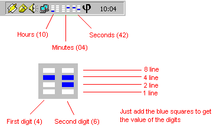



## Animated Binary Clock In System Tray

### Description

This is the ultimate geek thing, an animated binary clock in your system tray, configurable to show hours, minutes and seconds. It's quite wide, it takes up 3 icons in your tray, but the ultimate geekness is worth the valuable screen space. Look at the screenshot for an explanation of how to read the display, of course the real geeks among us won't need it :)

---UPDATED---

The Windows XP bug that reversed the icons is now history and the Settings persist between runs.
 
### More Info
 

             |
---                |---
**Submitted On**   |2002-10-23 10:14:50
**By**             |[Gerco Dries](https://github.com/Planet-Source-Code/PSCIndex/blob/master/ByAuthor/gerco-dries.md)
**Level**          |Intermediate
**User Rating**    |4.8 (96 globes from 20 users)
**Compatibility**  |VB 5\.0, VB 6\.0
**Category**       |[Complete Applications](https://github.com/Planet-Source-Code/PSCIndex/blob/master/ByCategory/complete-applications__1-27.md)
**World**          |[Visual Basic](https://github.com/Planet-Source-Code/PSCIndex/blob/master/ByWorld/visual-basic.md)
**Archive File**   |[Animated\_B14868710252002\.zip](https://github.com/Planet-Source-Code/gerco-dries-animated-binary-clock-in-system-tray__1-40088/archive/master.zip)

